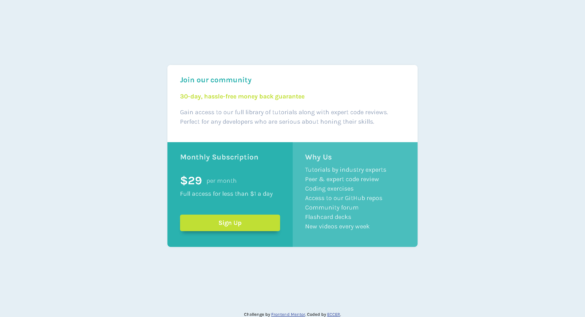

# Frontend Mentor - Single price grid component solution

This is a solution to the [Single price grid component challenge on Frontend Mentor](https://www.frontendmentor.io/challenges/single-price-grid-component-5ce41129d0ff452fec5abbbc). Frontend Mentor challenges help you improve your coding skills by building realistic projects. 

## Table of contents

- [Overview](#overview)
  - [The challenge](#the-challenge)
  - [Screenshot](#screenshot)
  - [Links](#links)
- [My process](#my-process)
  - [Built with](#built-with)
  - [What I learned](#what-i-learned)
  - [Continued development](#continued-development)
  - [Useful resources](#useful-resources)
- [Author](#author)
- [Acknowledgments](#acknowledgments)


## Overview

### The challenge

Users should be able to:

- View the optimal layout for the component depending on their device's screen size
- See a hover state on desktop for the Sign Up call-to-action

### Screenshot




### Links

- [Git Repository](https://github.com/ECCER/frontend-mentor-price-grid)
- [Live Page](https://frontend-mentor-price-grid-rho.vercel.app/)

## My process

### Built with

- Semantic HTML5 markup
- CSS custom properties
- Flexbox
- CSS Grid
- Mobile-first workflow
- Google Fonts

### What I learned

It is the first time that I have been encouraged to use css grid, I thought it was fun to learn it and I think I will use it more often.

```css
@media (min-width: 750px) {
    .card {
        display: grid;
        grid-template-columns: 1fr 1fr;
    }
    .cuadrado:first-child {
        grid-column: 1 / span 2;
    }
}
```

### Continued development

As I have no experience with grid, I will focus on learning how to implement it in other projects

### Useful resources

- [Resource 1](https://www.youtube.com/watch?v=edEG0CoM5gw) - This video helped me understand and apply grid easily and simply.
- [Resource 2](https://cssgridgarden.com/) - This is a very dynamic game to test and learn more about grid.

## Author

- Github - [ECCER](https://github.com/ECCER)
- Frontend Mentor - [@ECCER](https://www.frontendmentor.io/profile/ECCER)

## Acknowledgments

Thanks to the Kiko Palomares channel on youtube
